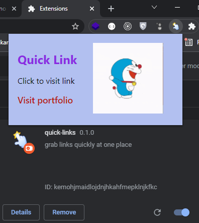

# Quick-link-chrome-extension
 
 - Many a times users forget the URL of their own portfolio, hence this extension can directly help them to jump to their portfolio link
   and saves their time.
   
## Preview

 
 ## Steps to install
  
  - Clone this repository.
  - Modify your `index.html` by adding your portfolio link
  - Open Chrome browser.
  - Navigate to chrome://extensions/
  - Toggle the developer mode (Activate it).
  - Click on 'Load Unpacked'.
  - Select the complete folder which you cloned in the first step.
